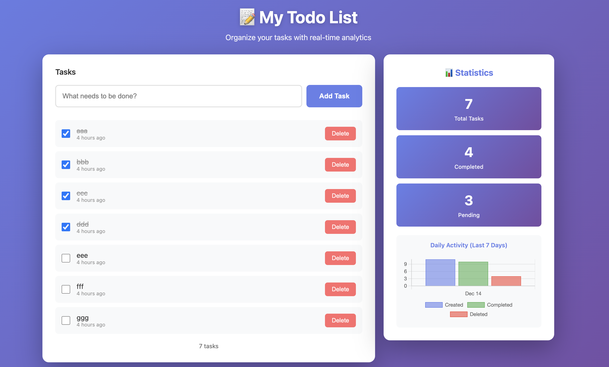

# Simple Todo App

A simple todo application built with microservices architecture, message queuing, and containerization.

Built with Flask, PostgreSQL, RabbitMQ, and Docker.

## Features

- ✅ Create, complete, and delete tasks
- 💾 Persistent storage with PostgreSQL
- 📊 Real-time statistics dashboard with charts
- 🔄 Asynchronous event processing with RabbitMQ
- 📈 Daily task analytics and activity tracking
- 🐳 Fully containerized with Docker Compose
- 🎨 Modern, responsive UI

## App UI



## Architecture

### System Overview

```
┌─────────────────────────────────────────────────────────────────┐
│                           Browser (User)                         │
│                      http://localhost:5000                       │
└──────────────────────────────┬──────────────────────────────────┘
                               │ HTTP/REST API
                               ↓
┌──────────────────────────────────────────────────────────────────┐
│                     Flask App (Producer)                          │
│  Port: 5000                                                       │
│  - Serves web UI (index.html)                                     │
│  - REST API endpoints (tasks, analytics)                          │
│  - Publishes events to RabbitMQ                                   │
└───────────┬─────────────────────────────────┬────────────────────┘
            │                                 │
            │ SQL Queries                     │ AMQP Messages
            ↓                                 ↓
┌─────────────────────────┐      ┌──────────────────────────────┐
│    PostgreSQL DB        │      │        RabbitMQ              │
│    Port: 5432           │      │        Port: 5672            │
│                         │      │                              │
│  Tables:                │      │  Queue: task_events          │
│  - tasks                │      │  - task_created              │
│  - task_statistics      │      │  - task_completed            │
│                         │      │  - task_uncompleted          │
└───────────┬─────────────┘      │  - task_deleted              │
            │                    └────────────┬─────────────────┘
            │                                 │ Consumes Messages
            │                                 ↓
            │                    ┌──────────────────────────────┐
            │                    │   Consumer Service           │
            │                    │  - Processes events          │
            └────────────────────┤  - Updates statistics        │
                                 │  - Logs activity             │
                                 └──────────────────────────────┘
```

### Components

#### 1. Flask App (Producer)
- **Technology**: Python Flask
- **Role**: Web server, API, and message producer
- **Responsibilities**:
  - Serves static HTML/CSS/JS
  - Handles REST API requests
  - Manages task CRUD operations in PostgreSQL
  - Publishes events to RabbitMQ when tasks change
  - Provides analytics endpoint

**API Endpoints**:
- `GET /` - Web UI
- `GET /api/tasks` - List all tasks
- `POST /api/tasks` - Create new task
- `PUT /api/tasks/<id>` - Update task (complete/uncomplete)
- `DELETE /api/tasks/<id>` - Delete task
- `GET /api/analytics` - Get statistics and daily activity

#### 2. PostgreSQL Database
- **Technology**: PostgreSQL 15 Alpine
- **Role**: Persistent data storage
- **Tables**:
  - `tasks`: Stores task data (id, title, completed, created_at, completed_at)
  - `task_statistics`: Stores daily aggregated metrics (date, tasks_created, tasks_completed, tasks_deleted)

#### 3. RabbitMQ
- **Technology**: RabbitMQ 3.12 Alpine
- **Role**: Message broker for asynchronous communication
- **Queue**: `task_events` (durable)
- **Message Format**:
```json
{
  "event_type": "task_created",
  "task": {
    "id": 1,
    "title": "Buy groceries",
    "completed": false,
    "created_at": "2024-12-14T10:00:00"
  },
  "timestamp": "2024-12-14T10:00:00"
}
```

#### 4. Consumer Service
- **Technology**: Python with pika (RabbitMQ client)
- **Role**: Background worker for analytics
- **Responsibilities**:
  - Subscribes to `task_events` queue
  - Processes task events (created, completed, deleted)
  - Updates daily statistics in PostgreSQL
  - Logs all activity for monitoring

### Data Flow

#### Creating a Task
```
User → Browser → Flask App → PostgreSQL (insert task)
                    ↓
                RabbitMQ (publish "task_created")
                    ↓
                Consumer → PostgreSQL (update statistics)
```

#### Viewing Analytics
```
User → Browser → Flask App → PostgreSQL (query statistics)
                    ↓
                Browser (display chart)
```

## Quick Start

### Run with Docker Compose

```bash

# Start all services (builds images if needed)
docker-compose up --build -d

# View all logs
docker-compose logs -f

# View consumer logs to see event processing
docker-compose logs -f consumer

# View specific service logs
docker-compose logs -f app

# Stop services (keeps data)
docker-compose down

# Stop and remove volumes (clears all data)
docker-compose down -v

# Rebuild and restart
docker-compose up --build -d
```

**Open browser**: http://localhost:5000

### Docker Services

The `docker-compose.yml` defines 4 services:

| Service | Container Name | Port | Description |
|---------|---------------|------|-------------|
| db | todo-db | 5432 | PostgreSQL database |
| rabbitmq | todo-rabbitmq | 5672 | RabbitMQ message broker |
| app | todo-app | 5000 | Flask web app (producer) |
| consumer | todo-consumer | - | Background worker (consumer) |

## Run Locally (without Docker Compose)

```bash
# Start PostgreSQL database
docker run -d \
  --name postgres-todo \
  -e POSTGRES_DB=tododb \
  -e POSTGRES_USER=postgres \
  -e POSTGRES_PASSWORD=postgres \
  -p 5432:5432 \
  postgres:15-alpine

# Start RabbitMQ
docker run -d \
  --name rabbitmq-todo \
  -p 5672:5672 \
  rabbitmq:3.12-alpine

# Create virtual environment
python3 -m venv venv

# Activate virtual environment
source venv/bin/activate  # On Windows: venv\Scripts\activate

# Install dependencies
pip install -r requirements.txt

# Set environment variables
export DB_HOST=localhost
export DB_PORT=5432
export DB_NAME=tododb
export DB_USER=postgres
export DB_PASSWORD=postgres
export RABBITMQ_HOST=localhost
export RABBITMQ_PORT=5672
export RABBITMQ_USER=guest
export RABBITMQ_PASSWORD=guest

# Run consumer (in one terminal)
cd src && python3 consumer.py

# Run app (in another terminal)
cd src && python3 app.py

# Open browser: http://localhost:5000
```

### Environment Variables

**Flask App**:
- `DB_HOST` - PostgreSQL host (default: localhost)
- `DB_PORT` - PostgreSQL port (default: 5432)
- `DB_NAME` - Database name (default: tododb)
- `DB_USER` - Database user (default: postgres)
- `DB_PASSWORD` - Database password (default: postgres)
- `RABBITMQ_HOST` - RabbitMQ host (default: localhost)
- `RABBITMQ_PORT` - RabbitMQ port (default: 5672)
- `RABBITMQ_USER` - RabbitMQ user (default: guest)
- `RABBITMQ_PASSWORD` - RabbitMQ password (default: guest)
